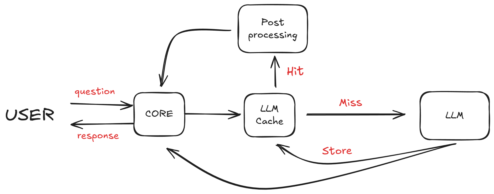

# LLM Caching System

A simple LLM cache design intergrated with a command line LLM chatbot.  

that uses vector similarity search to efficiently store and retrieve responses, reducing API calls and improving response times.

## Overview



### System Components:

1. **Core**: Orchestrates the interaction between the user and Cache/LLM
2. **LLM Cache**: Object to store, search and retrieve cached responses
3. **Post Processing**: Reranking, filtering and formatting of responses
4. **LLM Interface**: Handles communication with language models (currently supports only Hugging Face models)

### Other features/highlights:

- **Vector-based search**: Uses embeddings to store and find semantically similar queries
- **Redis Integration**: Leverages Redis for fast vector similarity search
- **Semantic Reranking**: Optional Cohere-based reranking for better match quality between query and cached responses
- **Configurable Cache**: Customizable TTL, eviction policies, and memory limits

## Installation

Install dependencies

```bash
pip install -r requirements.txt
```

for conda:

```bash
conda env create -f environment.yml
```

## Quickstart

```python
from core import Core
from hf import HuggingFaceChat
from llmcache import LLMCache


# Initialize components
llm_model = HuggingFaceChat(model_name="meta-llama/Llama-3.2-3B-Instruct")
cache = LLMCache(enable_rerank=True)
core = Core(llm_model, cache)

# Start the chat
core.chat()
```

Make sure redis server is running (more details in the [Redis docs](https://redis.io/docs/latest/operate/oss_and_stack/install/install-stack/))


## Configuration

### LLM Cache Settings

```python
cache = LLMCache(
redis_conn=None, # Optional Redis connection
embedding_dimension=384, # Embedding vector size
ttl_seconds=3600, # Cache entry lifetime
eviction_policy="allkeys-lru", # Redis eviction policy
max_memory_bytes=1_000_000_000, # Redis memory limit
enable_rerank=False # Enable Cohere reranking
)
```

### Core Settings

```python
core = Core(
    llm_model=llm_model,
    cache=cache,
    top_k=3,  # Number of similar cache entries to consider
    similarity_threshold=0.8  # Minimum similarity score for cache hits
)
```

### LLM Interface Settings

```python
llm_model = HuggingFaceChat(
    model_name="meta-llama/Llama-3.2-3B-Instruct"
)
```

## Clone the repository

```bash
git clone https://github.com/yourusername/llm_cache.git
cd llm_cache
```

## Acknowledgements

Much of my implementation was inspired by Zilliz's [GPTCache](https://github.com/zilliz/GPTCache). This project grew out of my curiosity to understand the systems that enable fast LLM inference, thereby significantly reducing latency and costs.